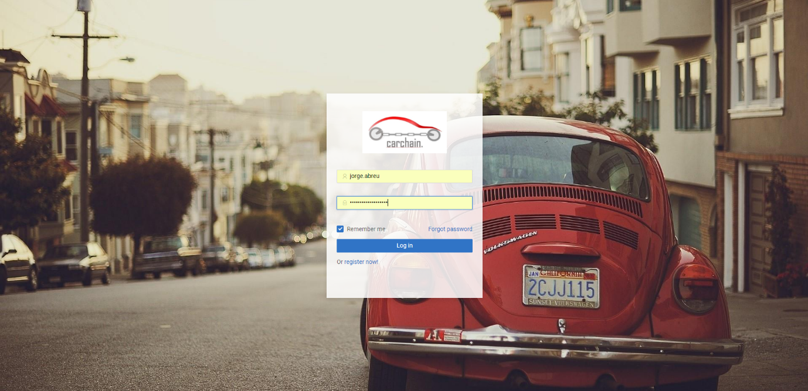
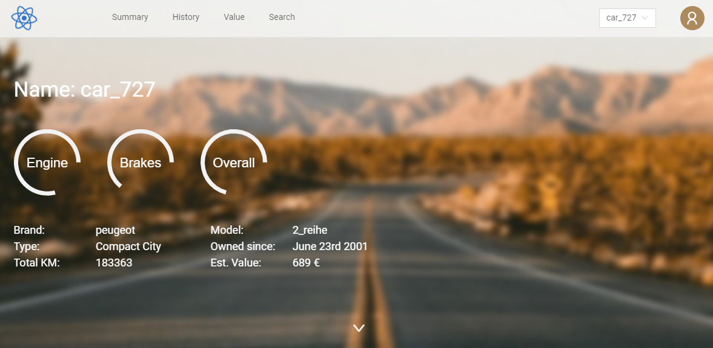
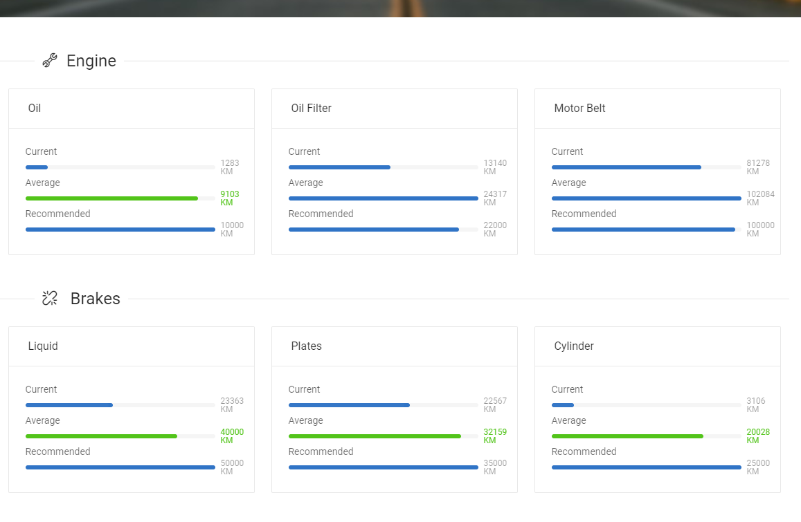
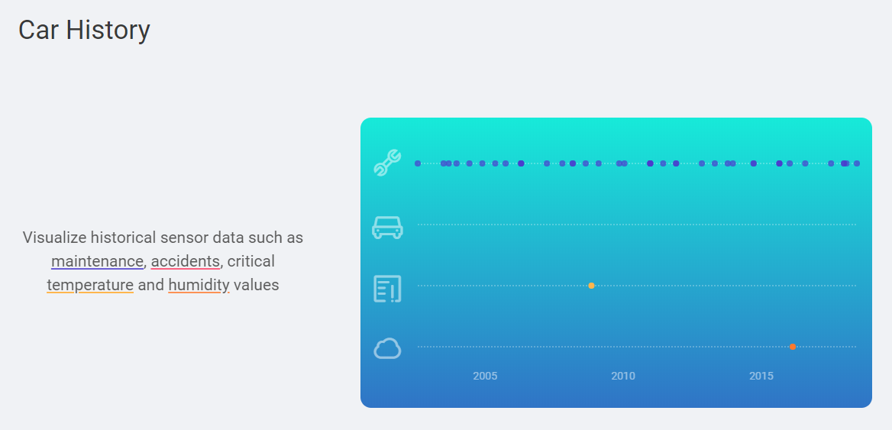
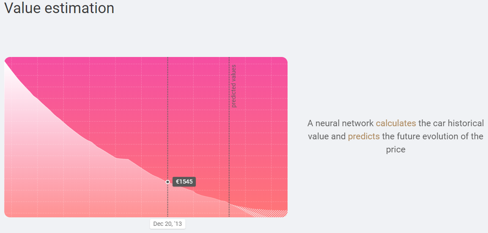

# Carchain Demo

Carchain is an Award Winning (SAP Forum 2018, IA4SP Most innovative project of 2018) application own by Datavard AG. Dr Jorge Abreu Vicente created the idea, the machine learning algorithms, database and pipeline. The frontend design and deployment are done by Mattia Molteni.

Carchain aims to generate a trustable used car market combining edge technologies such as machine learning, IoT and Blockchain (planned for future). 

This repository shows how we feed the data from the Raspberry PI to the Mongo DB database. The rest of the code, including frontend and machine learning algorithms, is privat.

Below we show a series of screenshots of the application:

#### Login Screen

#### General infromation about the car

#### Information on the regular maintenance of the vehicle (e.g. kms since last oil change)

#### Events that affect the life of the car. In this demo, only temperature, humidity, maintenance and accidents are shown.

#### Events shown above in form of a detailed list

#### Historical value estimates of the car. These are obtained via a neural network trained on historical data. It also shows a prediction on how the value of the car will evolve in the following years.

